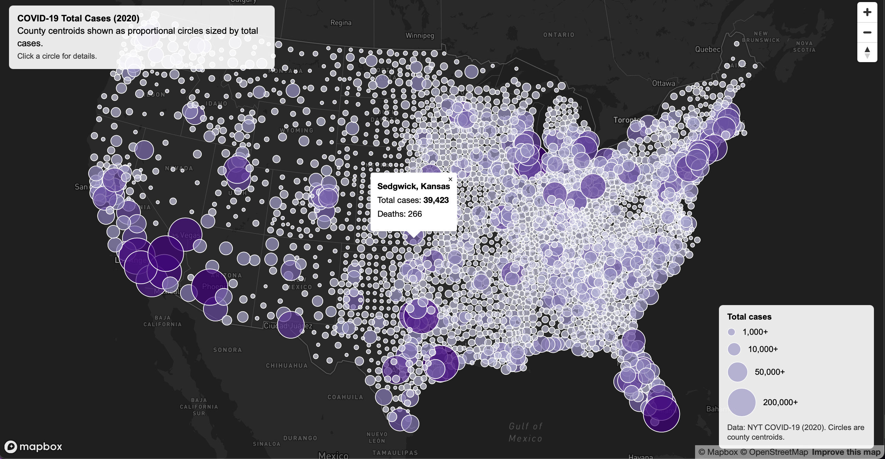
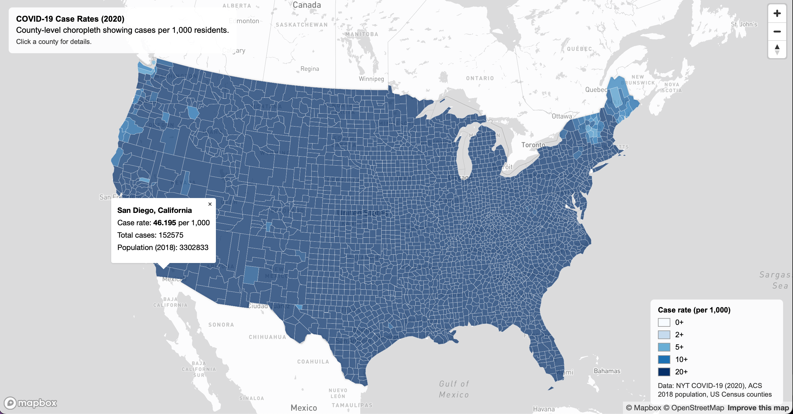

# COVID-19 Thematic Maps (United States, 2020)

## Project Overview
This project is a web mapping application created for **GEOG 458 – Web Map Application (Lab 3)**.  
The goal of the project is to visualize COVID-19 data in the United States during 2020 using two different thematic mapping techniques:

1. A **choropleth map** showing COVID-19 case rates by county  
2. A **proportional symbol map** showing total COVID-19 case counts by county  

These maps are designed to help users better understand the spatial distribution and intensity of COVID-19 across U.S. counties.

---

## Live Maps
- **Map 1 – COVID-19 Case Rates (Choropleth):**  
  https://yeab20.github.io/Covid_Maps/map1.html

- **Map 2 – COVID-19 Case Counts (Proportional Symbols):**  
  https://yeab20.github.io/Covid_Maps/map2.html

---

## Screenshots
### Choropleth Map – COVID-19 Case Rates

### Proportional Symbol Map – COVID-19 Case Counts

---

## Map Functions & Features

### Common Features (Both Maps)
- Interactive web maps built with **Mapbox GL JS**
- **Albers Equal Area projection** for appropriate U.S. spatial representation
- Appropriate basemap selection to emphasize thematic layers
- Legends explaining map symbology
- Interactive popups when users click on counties or symbols
- Map title, description, and data source information displayed on the map

### Map 1 – Choropleth (Case Rates)
- County-level choropleth map symbolized by **COVID-19 case rates per 1,000 residents**
- Sequential color scheme to represent low-to-high values
- Clickable counties display case rate information

### Map 2 – Proportional Symbols (Case Counts)
- County-level proportional symbols scaled by **total COVID-19 case counts**
- Symbol size increases with higher case counts
- Clickable symbols display total case numbers

---

## Libraries & Tools Used
- **Mapbox GL JS**
- **Mapshaper** (for GeoJSON conversion and simplification)
- HTML, CSS, and JavaScript

---

## Data Sources
- **COVID-19 Case Data:** The New York Times (2020)
- **Population Data:** 2018 ACS 5-Year Estimates
- **County Boundaries:** U.S. Census Bureau
